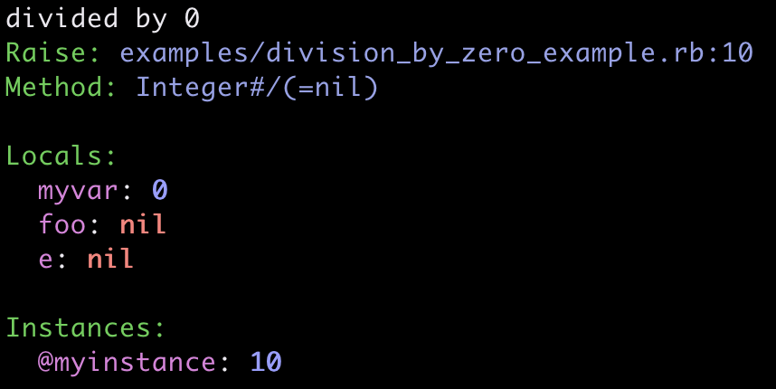

# EnhancedErrors

## Overview

**EnhancedErrors** is a pure Ruby gem that enhances exception messages by capturing and appending variables and their values from the scope where the error was raised.

**EnhancedErrors** leverages Ruby's built-in [TracePoint](https://ruby-doc.org/core-3.1.0/TracePoint.html) feature to provide detailed context for exceptions, making debugging easier without significant performance overhead.

When an exception is raised, EnhancedErrors captures the surrounding context.  It works like this:
<br>

#### Enhanced Exception In Code:

```ruby

require 'enhanced_errors'
require 'awesome_print' # Optional, for better output

EnhancedErrors.enhance!

def foo
  begin
    myvar = 0
    @myinstance = 10
    foo = @myinstance / myvar
  rescue => e
    puts e.message
  end
end

foo

```

##### Output:

</img>
<br>
#### Enhanced Exception In Specs:

```ruby
describe 'sees through' do

  let(:the_matrix) { 'code rains, dramatically' }

  before(:each) do
    @spoon = 'there is no spoon'
  end

  it 'the matrix' do
    #activate memoized item
    the_matrix
    stop = 'bullets'
    raise 'No!'
  end
end
```

#### Output:

</img>


## Features

- **Pure Ruby**: No external dependencies, C extensions, or C API calls.
- **Lightweight**: Minimal performance impact, as tracing is only active during exception raising.
- **Customizable Output**: Supports multiple output formats (`:json`, `:plaintext`, `:terminal`).
- **Flexible Hooks**: Redact or modifying captured data via the `on_capture` hook.
- **Environment-Based Defaults**: For Rails apps, automatically adjusts settings based on the environment (`development`, `test`, `production`, `ci`).
- **Pre-Populated Skip List**: Comes with predefined skip lists to exclude irrelevant variables from being captured.
- **Capture Levels**: Supports `info` and `debug` levels, where `debug` level ignores the skip lists for more comprehensive data capture.
- **Capture Types**: Captures variables from the first `raise` and the last `rescue` for an exception by default.
- **No dependencies**:  EnhancedErrors does not ___require___ any dependencies--it uses [awesome_print](https://github.com/awesome-print/awesome_print) for nicer output if it is installed and available.

EnhancedErrors has a few big use-cases:

* **Catch Data-driven bugs**. For example, if, while processing a 10 gig file, you get an error, you can't just re-run the code with a debugger.
You also can't just print out all the data, because it's too big. You want to know what the data was the cause of the error.
Ideally, without long instrument-re-run-fix loops. If your logging didn't capture the data, normally, you'd be stuck. 

* **Debug** a complex application erroring deep in the stack when you can't tell where the error originates

* **Faster TDD** - Often, you won't have to re-run to see an error--you can go straight to the fix.

* **Faster CI -> Fix loop**. When a bug happens in CI, usually there's a step where you first reproduce it locally.
  EnhancedErrors can help you skip that step.

* **Faster debugging**. In general, you can skip the add-instrumentation step and jump to the fix.

* **Heisenbugs** - bugs that disappear when you try to debug them. EnhancedErrors can help you capture the data that causes the bug before it disappears.

* **Unknown Unknowns** - you can't pre-emptively log variables from failure cases you never imagined.

* **Cron jobs** and **daemons** - when it fails for unknown reasons at 4am, check the log and fix--it probably has what you need.

## Installation

Add this line to your `Gemfile`:

```ruby
gem 'enhanced_errors'
```

Then execute:

```shell
$ bundle install
```

Or install it yourself with:

```shell
$ gem install enhanced_errors
```

## Basic Usage

To enable EnhancedErrors, call the `enhance!` method:

```ruby
# For a rails app, put this in an initializer, or spec_helper.rb
# ex:  config/initializers/enhanced_errors.rb

require 'awesome_print' # Optional, for better output
EnhancedErrors.enhance!

# -> now your error messages will have variables and their values appended to them.

```

This activates the TracePoint to start capturing exceptions and their surrounding context.


### Configuration Options

You can pass configuration options to `enhance!`:

```ruby
EnhancedErrors.enhance!(enabled: true, max_length: 2000) do
  # Additional configuration here
  add_to_skip_list :@instance_variable_to_skip, :local_to_skip
end

```
- `add_to_skip_list`: Variables to ignore, as symbols. ex:  :@instance_variable_to_skip, :local_to_skip`
- `enabled`: Enables or disables the enhancement (default: `true`).
- `max_length`: Sets the maximum length of the enhanced message (default: `2500`).

Currently, the first `raise` exception binding is presented. 
This may be changed in the future to allow more binding data to be presented.


### Environment-Based Defaults

EnhancedErrors adjusts its default settings based on the environment:

- **Development/Test**:
    - Default Output format: `:terminal`
    - Terminal Color output: Enabled
- **Production**:
    - Output format: `:json`
    - Terminal Color output: Disabled
- **CI Environment**:
    - Output format: `:plaintext`
    - Color output: Disabled

The environment is determined by `ENV['RAILS_ENV']`, `ENV['RACK_ENV']`, or detected CI environment variables like:
- `CI=true`

### Output Formats

You can customize the output format:

- **`:json`**: Outputs the captured data in JSON format.
- **`:plaintext`**: Outputs plain text without color codes.
- **`:terminal`**: Outputs text with terminal color codes.

Example:

```ruby
EnhancedErrors.format(captured_bindings, :json)
```

### Customizing Data Capture

#### Using `on_capture`

The `on_capture` hook allows you to modify or redact data as it is captured. For each captured binding
it yields out a hash with the structure below. Modify it as needed and return the modified hash.

```ruby 
{
  source: source_location,
  object: Object source of error,
  library: true or false,
  method_and_args: method_and_args,
  variables: {
    locals: locals,
    instances: instances,
    lets: lets,
    globals: globals
  },
  exception: exception.class.name,
  capture_type: capture_type # 'raise' or 'rescue'
}
```


```ruby
EnhancedErrors.on_capture do |binding_info|
  # Redact sensitive data
  if binding_info[:variables][:locals][:password]
    binding_info[:variables][:locals][:password] = '[REDACTED]'
  end
  binding_info  # Return the modified binding_info
end
```


#### Using `eligible_for_capture`

The `eligible_for_capture` hook yields an Exception, and allows you to decide whether you want to capture it or not.
By default, all exceptions are captured. When the block result is true, the error will be captured.
Error capture is relatively cheap, but ignoring errors you don't care about makes it almost totally free.
One use-case for eligible_for_capture is to run a string or regexp off a setting flag, which 
lets you turn on and off what you capture without redeploying.

```ruby 
EnhancedErrors.eligible_for_capture do |exception|
  exception.class.name == 'ExceptionIWantTOCatch'
end


```

#### Using `on_format`

`on_format` is the last stop for the message string that will be appended to `exception.message`.

Here it can be encrypted, rewritten, or otherwise modified.


```ruby
EnhancedErrors.on_format do |formatted_string|
  "---whatever--- #{formatted_string} ---whatever---"
end

```


#### Applying a Variable Skip List

EnhancedErrors comes with predefined skip lists to exclude sensitive or irrelevant variables. 
By default, the skip list is used to remove a lot of framework noise from Rails and RSpec.
You can add additional variables to the skip list as needed:

```ruby
 
EnhancedErrors.enhance! do
  add_to_skip_list :@variable_to_skip
end

```

The skip list is pre-populated with common variables to exclude and can be extended based on your application's requirements. 


### Capture Levels

EnhancedErrors supports different capture levels to control the verbosity of the captured data:

- **Info Level**: Respects the skip list, excluding predefined sensitive or irrelevant variables. Global variables are ignored.
- **Debug Level**: Ignores the skip lists, capturing all variables including those typically excluded and global variables.
  Global variables are only captured in debug mode, and they exclude the default Ruby global variables.

**Default Behavior**: By default, `info` level is used, which excludes variables in the skip list to protect sensitive information. In `debug` mode, the skip lists are ignored to provide more comprehensive data, which is useful during development but should be used cautiously to avoid exposing sensitive data.
The info mode is recommended.


### Capture Types

EnhancedErrors differentiates between two types of capture events:

- **`raise`**: Captures the context when an exception is initially raised.
- **`rescue`**: Captures the context when an exception is last rescued.

**Default Behavior**: By default, EnhancedErrors returns the first `raise` and the last `rescue` event for each exception. 
The `rescue` exception is only available in Ruby 3.2+ as it was added to TracePoint events in Ruby 3.2.


### Example: Redacting Sensitive Information

```ruby
EnhancedErrors.on_capture do |binding_info|
  sensitive_keys = [:password, :ssn, :health_info]
  sensitive_keys.each do |key|
    if binding_info[:variables][:locals][key]
      binding_info[:variables][:locals][key] = '[REDACTED]'
    end
  end
  binding_info
end
```

## How It Works

EnhancedErrors uses Ruby's `TracePoint` to listen for `:raise` and `:rescue` events. 
When an exception is raised or rescued, it captures:

- **Local Variables**: Variables local to the scope where the exception occurred.
- **Instance Variables**: Instance variables of the object.
- **Method and Arguments**: The method name and its arguments.
- **Let Variables**: RSpec let variables, if applicable. Only memoized (evaluated) let variables are captured.
- **Global Variables**: Global variables, in debug mode.

The captured data includes a `capture_type` field indicating whether the data was captured during a `raise` or `rescue` event. By default, EnhancedErrors returns the first `raise` and the last `rescue` event for each exception, providing a clear trace of the exception lifecycle.

The captured data is then appended to the exception's message, providing rich context for debugging.


## Awesome Print

EnhancedErrors automatically uses the [awesome_print](https://github.com/awesome-print/awesome_print) 
gem to format the captured data, ___if___ it is installed and available.
If not, error enhancement will work, but the output may be less pretty (er, awesome).
AwesomePrint is not required directly by EnhancedErrors, so you will need to add it to your Gemfile 
if you want to use it.

```ruby
gem 'awesome_print'
```


## Performance Considerations

- **Minimal Overhead**: Since TracePoint is only activated during exception raising and rescuing, the performance impact is negligible during normal operation.
- **Production Safe**: The gem is designed to be safe for production use, giving you valuable insights without compromising performance.

## Contributing

Bug reports and pull requests are welcome on GitHub at [https://github.com/your_username/enhanced_errors](https://github.com/your_username/enhanced_errors).

## License

The gem is available as open-source under the terms of the [MIT License](https://opensource.org/licenses/MIT).

